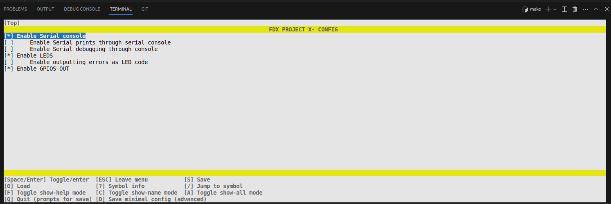

# Configuration
## Approach
In Embedded, a "project" is defined by the functionality that the product or device has. For example: "Weather station project". But in any company, the hardware used to 
make that Weather Station may vary. That's why configuration is so important.
The main idea would be to have an interface for each sub-system, and have the source file be a driver or HW specific implementation, then you may choose the source file 
to include or compile against by evaluating conditional variables.
The issue is that doing this by hand is tremendously tedious and error prone. That's why this project has been integrated with Kconfig. For more info on this see the 
/cmake-kconfig/README.md.
After the configuration stage is done, all of these variables are gonna be automatically generated and put into the autoconf.h header. Simple example of autogenerated .h:
```
#define CONFIG_SERIAL_CONSOLE_ENABLED 1
#define CONFIG_LEDS_ENABLED 1
#define CONFIG_GPIOS_OUT_ENABLED 1
```
Then any other file can include autoconf.h, and choose which source to include based on this, or which functions, or make CMake choose which .c .cpp to compilea against. 


## Kconfig + menuconfig
The menu is rendered by parsing the Kconfig that lies within this folder. That means that you can tailor which options do you want to have in the project, which could be
from what boards are supported or not, to enabling or disabling specific features. 

For more info on Kconfig script language:
[Kconfig script language](https://www.kernel.org/doc/html/next/kbuild/kconfig-language.html)

Example of menuconfig GUI:


### TODO
- There's a config.h.in as an example that could hold the version of the software. This could be really useful since you can use these coded variables to embed them
  into the ELF. Or use it in the code to print it somewhere else.
